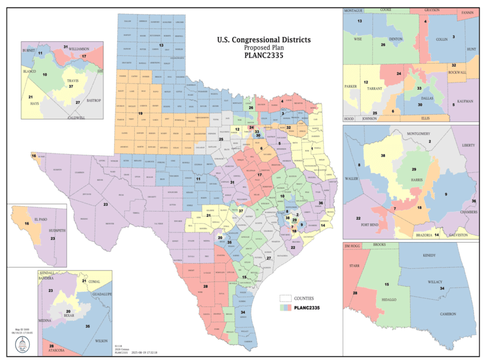

<!-- PROJECT LOGO -->
<br />
<div align="center">
  <a href="https://github.com/othneildrew/Best-README-Template">
    
  </a>

  <h3 align="center">A Quantitative Analysis of Negative Racial Gerrymandering in Texas</h3>

  <p align="center">
    An Illinois Institute of Technology study quantifying negative racial gerrymandering in Texas as a result of SB4.
    <br />
    <a href=""><strong>Explore Publication »</strong></a>
    <br />
    <br />
    <a href="">Website</a>
    &middot;
    <a href="https://github.com/algorithmicprogrammer/texas-gerrymandering-hb4/issues/new?labels=bug&template=bug-report---.md">Report Bug</a>
    &middot;
    <a href="https://github.com/algorithmicprogrammer/texas-gerrymandering-hb4/issues/new?labels=enhancement&template=feature-request---.md">Request Feature</a>
  </p>
</div>

<!-- TABLE OF CONTENTS -->
<details>
  <summary>Table of Contents</summary>
  <ol>
    <li>
      <a href="#about-the-project">About The Project</a>
      <ul>
        <li><a href="#data-sources">Data Sources</a></li>
        <li><a href="#machine-learning-models">Machine Learning Models</a>
          <ul>
          <li><a href="#classification">Classification</a></li>
            <ul>
              <li><a href="#using-linear-regression-for-classification-with-one-hot-encoding">Using Linear Regression for Classification with One-Hot Encoding</a></li>
              <li><a href="#using-logistic-regression-lda-and-random-forest-for-classification">Using Logistic Regression, LDA, and Random Forest for Classification</a></li>
          </ul>  
          <li><a href="#clustering">Clustering</a>
            <ul>
              <li><a href="#k-means-clustering">K-Means Clustering</a></li>
            </ul>  
          </li>
          </ul>  
        </li>
        <li><a href="#technologies-used">Technologies Used</a></li>
      </ul>
    </li>
    <li>
      <a href="#getting-started">Getting Started</a>
      <ul>
        <li><a href="#prerequisites">Prerequisites</a></li>
        <li><a href="#installation">Installation</a></li>
      </ul>
    </li>
    <li><a href="#usage">Usage</a></li>
    <li><a href="#roadmap">Roadmap</a></li>
    <li><a href="#contributing">Contributing</a></li>
    <li><a href="#license">License</a></li>
    <li><a href="#contact">Contact</a></li>
    <li><a href="#acknowledgments">Acknowledgments</a></li>
  </ol>
</details>

## About the Project
<a href="https://data.capitol.texas.gov/dataset/77a803d2-c443-411e-9e01-faae37f30b43/resource/532d076b-a63a-4350-9121-817dc5dbf449/download/planc2335.pdf"></a>

### Data Sources
<ul>
  <li>
    <a href="https://data.capitol.texas.gov/dataset/planc2335/resource/3552af40-54c1-45f2-9b02-b3c560bc0879">
    Texas Legislative Council Congressional District Geospatial Data (PLANC2335 Shapefile)
    </a>
      <ul>
        <li>The new district map's geospatial data is used for computing compactness scores, which are a widely-accepted indicator of gerrymandering.
        This shapefile contains the district geometries that will be compared against Census/election results data.
        </li>
      </ul>
  </li> 
  <li>
    <a href="https://api.census.gov/data/2020/dec/pl">
    2020 Decennial Census Redistricting PL-94-171 API
    </a>  
  </li>
    <ul>
      <li>This API, provided by the U.S. Census Bureau, provides 2020 Texas voter age population breakdowns by race at the census-block level.</li>
    </ul>
  <li>
    <a href="https://www2.census.gov/geo/tiger/TIGER2020PL/LAYER/tl_2020_48_tabblock20.zip">
    2020 Texas U.S. Census Blocks Geospatial Data (tl_2020_48_tabblock20 Shapefile)
    </a>
      <ul>
        <li>
        The geospatial data for the 2020 Texas U.S. Census blocks will be joined with the census block-level voter age population demographics from the 2020 
        Decennial Censusu Redistricting API.
        The census block geospatial data will be overlayed with the new district map's geospatial data to map racial composition in each congressional district.
        </li>
      </ul>
  </li>
  <li>
    <a href="https://data.capitol.texas.gov/dataset/comprehensive-election-datasets-compressed-format/resource/e1cd6332-6a7a-4c78-ad2a-852268f6c7a2">
    Texas Legislative Council 2024 Voting Districts General Election Data  
    </a>
      <ul>
        <li>Precinct-level election results data will be used to compute precinct-level votes by party. This dataset will be used to quantify partisanship in congressional districts; unfortunately, Texas voter registration does not record party affiliation, so this dataset is our most reliable source of partisanship information.</li>
      </ul>
  </li>
  <li><a href="https://data.capitol.texas.gov/dataset/4d8298d0-d176-4c19-b174-42837027b73e/resource/906f47e4-4e39-4156-b1bd-4969be0b2780/download/vtds_24pg.zip">Texas Legislative Council 2024 Primary & General Elections Voting Districts Geospatial Data (vtds_24pg Shapefile)<a></li>
</ul>

### Machine Learning Models
#### Classification 
##### Using Linear Regression for Classification with One-Hot Encoding
In our linear regression model, the dependent variable will be the partisan outcome in each Texas congressional district under the new redistricting map. The independent variables will be the district's racial demographics and party affiliation. If it is discovered upon comparing coefficients that racial minority demographics have massive weights independent of party affiliation, this will indicate negative racial gerrymandering.

##### Using Logistic Regression, LDA, and Random Forest for Classification
The following models will be trained:
<ul>
  <li>Determining partisan outcome in each Congressional District by compactness scores.</li>
  <li>Determining partisan outcomes in each Congressional District by compactness scores and party affiliation.</li>
  <li>Determining partisan outcomes in each Congressional District by compactness scores, party affiliation, and racial demographics.</li>
</ul>
If adding racial demographics features to the model drastically improves the model's performance, that is indicative of gerrymandering.

#### Clustering
##### K-Means Clustering
With k-means clustering, we will partition congressional districts into k groups. If the clusters align most closely with racial composition, then that is indicative of race determining the groupings - and of negative racial gerrymandering. If clusters disappear when racial features are removed from the model, then that indicates that race is shaping the congressional districts and is thus evidence of negative racial gerrymandering. 

### Technologies Used
<code></code> 
<code></code> 
<code></code>
<code></code>

## Project Organization

```
├── LICENSE            <- Open-source license if one is chosen
├── Makefile           <- Makefile with convenience commands like `make data` or `make train`
├── README.md          <- The top-level README for developers using this project.
├── data
│   ├── external       <- Data from third party sources.
│   ├── interim        <- Intermediate data that has been transformed.
│   ├── processed      <- The final, canonical data sets for modeling.
│   └── raw            <- The original, immutable data dump.
│
├── docs               <- A default mkdocs project; see www.mkdocs.org for details
│
├── models             <- Trained and serialized models, model predictions, or model summaries
│
├── notebooks          <- Jupyter notebooks. Naming convention is a number (for ordering),
│                         the creator's initials, and a short `-` delimited description, e.g.
│                         `1.0-jqp-initial-data-exploration`.
│
├── pyproject.toml     <- Project configuration file with package metadata for 
│                         texas_gerrymandering_hb4 and configuration for tools like black
│
├── references         <- Data dictionaries, manuals, and all other explanatory materials.
│
├── reports            <- Generated analysis as HTML, PDF, LaTeX, etc.
│   └── figures        <- Generated graphics and figures to be used in reporting
│
├── requirements.txt   <- The requirements file for reproducing the analysis environment, e.g.
│                         generated with `pip freeze > requirements.txt`
│
├── setup.cfg          <- Configuration file for flake8
│
└── texas_gerrymandering_hb4   <- Source code for use in this project.
    │
    ├── __init__.py             <- Makes texas_gerrymandering_hb4 a Python module
    │
    ├── config.py               <- Store useful variables and configuration
    │
    ├── dataset.py              <- Scripts to download or generate data
    │
    ├── features.py             <- Code to create features for modeling
    │
    ├── modeling                
    │   ├── __init__.py 
    │   ├── predict.py          <- Code to run model inference with trained models          
    │   └── train.py            <- Code to train models
    │
    └── plots.py                <- Code to create visualizations


```
## Acknowledgements
For academic citations, view the references folder. For software attributions and collaborator aknowledgements, view the acknowledgements folder.


